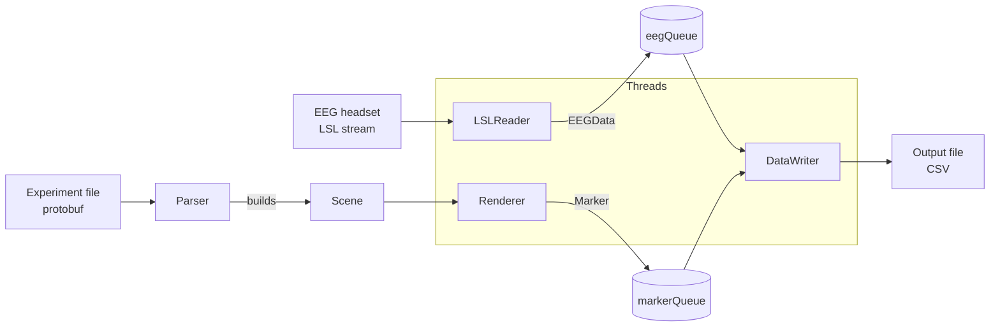
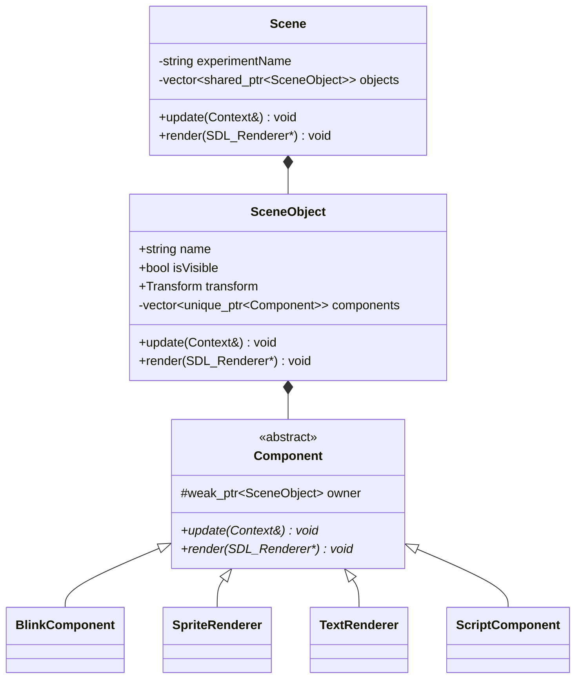

# NeuronIDE Runtime

> Single source of project context. This document is intentionally written to be
> self-contained so that a person *or a language model* can understand the goal,
> the architecture, the current implementation status, and how to build/test the
> project without reading the source first.

## 1. What this project is

**NeuronIDE** is a tool for designing and running **EEG experiments**. It has two parts:

- an **editor** (out of scope for this repository) that lets a researcher visually
  design an experiment and serializes it to a file, and
- a **runtime** (this repository, `Neuron-IDE-runtime`) that reads that file,
  reconstructs the experiment as a scene, runs it, and records the data.

Running an experiment means:

1. **Reading EEG data** from the participant's headset (the "cap") in real time.
2. **Rendering a graphical interface** that drives the participant — e.g. telling
   them what to focus on, or, for **SSVEP** experiments, flickering on-screen
   objects at controlled frequencies.
3. **Emitting time markers** for experiment events (e.g. "stimulus shown"),
   stamped at the exact moment the corresponding frame hits the screen.
4. **Persisting** the EEG samples and the markers, with timestamps, to an output
   file for later offline analysis.

The hard requirement that shapes the whole design is **temporal alignment**: the
EEG samples and the stimulus markers must share a **common clock domain** so that
"this brain response happened N ms after that stimulus" is meaningful. See
[§4 Clock synchronization](#4-clock-synchronization-critical).

## 2. Tech stack

| Concern                  | Choice                                                                 |
| ------------------------ | ---------------------------------------------------------------------- |
| Language                 | C++20                                                                  |
| Build system             | CMake (≥ 3.25), Ninja-friendly                                         |
| Experiment file format   | Protocol Buffers (proto3) — see `protoFiles/neuronide.proto`           |
| Device config format     | JSON (`config.json`) parsed with [nlohmann/json](https://github.com/nlohmann/json) |
| EEG acquisition          | [LSL — Lab Streaming Layer](https://github.com/sccn/liblsl) (`liblsl`) |
| Rendering / windowing    | SDL2 (+ SDL2_image), with vsync                                        |
| Inter-thread queues      | [moodycamel ConcurrentQueue](https://github.com/cameron314/concurrentqueue) (lock-free) |
| Python scripting (planned)| pybind11 (`ScriptComponent`)                                          |
| Testing                  | GoogleTest + CTest                                                     |
| Tooling                  | clang-format, clang-tidy, gcovr (coverage)                             |

`liblsl`, `concurrentqueue`, `nlohmann/json`, and `googletest` are fetched
automatically by CMake (`FetchContent`). SDL2 and Protobuf are expected to be
installed on the system.

## 3. Architecture

The runtime starts by parsing the experiment file into a **Scene**, then runs the
experiment across cooperating threads coordinated by a top-level `Runtime` object.
The design follows a **game-engine-like component model**: a `Scene` owns
`SceneObject`s, and each `SceneObject` owns `Component`s that implement behavior.

### Data flow



- **Parser** reads the protobuf experiment file and produces a `Scene`
  (objects + components). Stateless entry point: `Parser::parse(path)`.
- **Renderer** owns the SDL window, runs the update→render loop, and uses **vsync**
  so it can timestamp markers at the *actual* moment of screen refresh. Components
  emit marker names during `update`; the Renderer stamps them with
  `lsl::local_clock()` right after `SDL_RenderPresent` and pushes `Marker`s onto
  `markerQueue`.
- **LSLReader** resolves and subscribes to the EEG LSL stream and continuously
  pushes `EEGData` samples onto `eegQueue`.
- **DataWriter** drains both queues and writes them to disk via a pluggable
  formatting strategy (currently CSV).

The two queues (`eegQueue`, `markerQueue`) are the only shared state between
threads and are **lock-free** (`moodycamel::ConcurrentQueue`). Producers
(Renderer, LSLReader) never block on consumers (DataWriter).

### Component model



Components are built from protobuf messages by a **`ComponentRegistry`** (a
singleton mapping a proto component type id → factory function). New component
types self-register via the `REGISTER_COMPONENT(typeId, creatorFunc)` macro, so
the parser does not need to know about concrete component classes.

### Core data structures

```cpp
struct EEGData {                 // one EEG sample
    double              timestamp;   // in the local_clock() domain (see §4)
    std::vector<double> channels;
};

struct Marker {                  // one experiment event
    std::string eventName;
    double      timestamp;       // local_clock() at vsync
};

struct Context {                 // passed to Component::update each frame
    double                    timestamp;   // per-frame delta time
    std::vector<std::string>* markers;     // sink: components append marker names here
};
```

## 4. Clock synchronization (critical)

EEG analysis depends on EEG samples and stimulus markers being **comparable in
time**. The Renderer stamps markers with `lsl::local_clock()` (this machine's
clock). LSL `pull_sample()`, however, returns timestamps in the **sender's** clock
domain. If left unconverted, samples and markers would live in different clocks
and could not be aligned.

`LSLReader` therefore enables LSL inlet **post-processing**
(`post_clocksync | post_dejitter | post_monotonize`) so the timestamps it stores
are already mapped into the local `lsl::local_clock()` domain — the same clock the
Renderer uses. This is the single most important correctness property of the data
path.

## 5. Thread lifecycle conventions

Threads use C++20 `std::jthread` + `std::stop_token` for cooperative cancellation.
Two ownership patterns are in use:

- **Self-owned thread** (`LSLReader`, `DataWriter`): the class owns its `jthread`.
  `start(...)` spawns the worker (and first calls `stop()` so it is restartable);
  `stop()` requests stop, joins, and releases resources; the destructor calls
  `stop()`. The worker loop body takes the `stop_token`.
- **Caller-owned thread** (`Renderer`): the class exposes `render(stop_token)` and
  the *caller* owns the thread driving it. This makes the loop trivially testable
  by passing an injected `std::stop_source`.

`LSLReader` additionally resolves its stream **lazily on the worker thread** (so
`start()` returns immediately instead of blocking the runtime while waiting for the
cap), uses a **blocking pull with a finite timeout** (no busy-wait, low latency,
periodic stop-token checks), and catches `lsl::lost_error` to re-resolve a dropped
stream rather than letting an exception terminate the process.

## 6. Implementation status

| Area / class                | Status        | Notes                                                        |
| --------------------------- | ------------- | ------------------------------------------------------------ |
| `Parser`                    | Implemented   | protobuf → `Scene`                                           |
| `Scene` / `SceneObject`     | Implemented   | component containers                                          |
| `Component` (base)          | Implemented   | abstract `update` / `render`                                 |
| `ComponentRegistry`         | Implemented   | proto-type → factory, macro-based self-registration          |
| `specifiic components` | **Planned** | defined in `neuronide.proto`, not yet implemented in C++     |
| `Renderer`                  | Implemented   | SDL + vsync, marker timestamping                             |
| `LSLReader`                 | Implemented   | LSL inlet → `eegQueue`, clock-synced (see §4); driven by `LSLConfig` |
| `ConfigParser`              | Implemented   | `config.json` → `ExperimentConfig` (incl. `LSLConfig`), nlohmann/json |
| `DataWriter`                | Implemented   | strategy-based; `CSVFormatStrategy`                          |
| `Runtime` orchestration     | **Stub**      | currently does nothing |

The class diagram in older docs is partly aspirational; the table above reflects
the actual code.

## 7. Repository layout

```
Neuron-IDE-runtime/       # the C++ runtime (git repo)
  ├── README.md             # this file, code context
  ├── CMakeLists.txt        # top-level: deps, warnings, static analysis, coverage
  ├── cmake/                # Dependencies / CompilerWarnings / StaticAnalysis / Coverage
  ├── protoFiles/
  │   ├── neuronide.proto   # experiment file schema
  │   └── tests/            # .pbtxt fixtures + compiled .pb
  ├── include/              # public headers, mirrored by src/
  │   ├── data_structures/  # EEGData, Marker, Context
  │   ├── config/           # ConfigParser + ExperimentConfig / LSLConfig / ChannelConfig
  │   ├── parser/           # Parser
  │   ├── scene/            # Scene, SceneObject, components/
  │   ├── renderer/         # Renderer
  │   ├── lslreader/        # LSLReader
  │   ├── datawriter/       # DataWriter, IDataFormatStrategy, CSVFormatStrategy
  │   └── Runtime.hpp
  ├── src/                  # one CMake subdirectory (static lib) per module
  └── tests/
      ├── unit_tests/       # CTest label: "unit"
      └── component_tests/  # CTest label: "component"
```

Each `src/<module>/` builds a static library; `runtime_core` links them together
and the `NeuronIDE` executable links `runtime_core`.

## 8. Build, test, and tooling

All commands are run from the `Neuron-IDE-runtime/` directory.

### Dependencies (Linux)

```bash
sudo apt update
sudo apt install cmake clang-format clang-tidy libsdl2-dev protobuf-compiler gcovr
# GTest, LSL and concurrentqueue are fetched automatically by CMake.
```

### Configure & build

```bash
cmake -B build
cmake --build build
./build/src/NeuronIDE config.json experiment.neuroz  # parses the device config, parses scene, starts LSLReader, DataWriter, Renderer.
```

`NeuronIDE` takes the path to a device `config.json` (defaults to `config.json` in
the working directory).

### Tests

```bash
cd build
ctest --output-on-failure          # all tests
ctest -L unit --output-on-failure  # unit tests only
ctest -L component --output-on-failure
```

> Note: `LSLReader` unit tests open a local LSL stream and exercise a real
> outlet→inlet round-trip over loopback; they need loopback multicast to be
> available.

### Formatting & static analysis

- Style: `.clang-format` (Google base, 4-space indent, 100 col, aligned
  declarations/assignments). Checks: `.clang-tidy`
  (`bugprone-*`, `cppcoreguidelines-*`, `performance-*`, `readability-*`).
- Auto-format every tracked source/header:
  ```bash
  cmake --build build --target format
  ```

### Coverage

```bash
cmake -B build -DNEURON_IDE_ENABLE_COVERAGE=ON
cmake --build build
cmake --build build --target coverage     # runs tests + gcovr
xdg-open build/coverage/index.html
```

### Working with protobuf fixtures

Author a `.pbtxt` (see `protoFiles/tests/test_scene.pbtxt`), then encode it:

```bash
protoc --encode=NeuronIDE.Scene protoFiles/neuronide.proto \
  < protoFiles/tests/test_scene.pbtxt > protoFiles/tests/test_scene.pb
```

## 9. Contribution conventions

- **Branches:** `<type>/<description>`, e.g. `feat/setup-project`.
- **Commits:** `<type>(optional scope): description`, e.g.
  `feat(parser): create Parser class`.
- **Types:** `feat`, `fix`, `style` (clang config), `test`, `ci` (`.github`).

